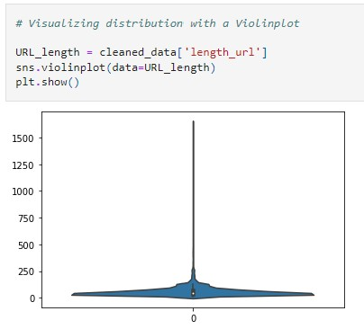
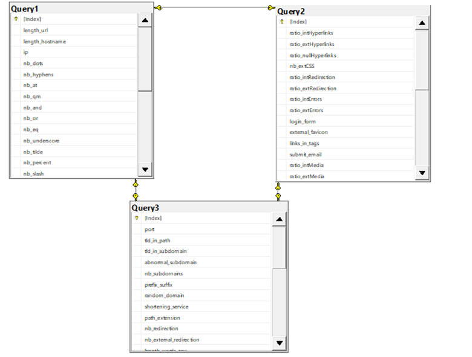
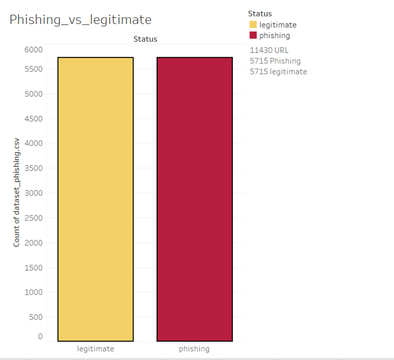

#  Phishing Detection 

  

In this project, a dataset containing 11430 URLs with 87 extracted features. The dataset is designed to be used as benchmarks for machine learning-based phishing detection systems. Features are from three different classes: 56 extracted from the structure and syntax of URLs, 24 extracted from the content of their correspondent pages, and 7 are extracted by querying external services. The dataset is balanced, it contains exactly 50% phishing and 50% legitimate URLs.

## Context 
Phishing continues to prove one of the most successful and effective ways for cybercriminals to defraud us and steal our personal and financial information.
Our growing reliance on the internet to conduct much of our day-to-day business has provided fraudsters with the perfect environment to launch targeted phishing attacks. The phishing attacks taking place today are sophisticated and increasingly more difficult to spot. A study conducted by Intel found that 97% of security experts fail at identifying phishing emails from genuine emails. The purpose of this project is to identify if there is a threat of phishing based on whether a URL is seeking to steal data, money, or both.

## Questions we hope to answer 
- After cleaning and pre-processing our data, is our dataset optimized enough to go through different machine learning models?
- Which machine learning model will be better for our dataset?
- Will we be able to determine whether or not a URL is phishing or legitimate?

## Approach to create website
- Write code to extract the required features from csv file
- Analyze and preprocess the dataset by using EDA techniques
- Run selected machine learning and deep neural network algorithms like SVM, Random Forest, Autoencoder on the dataset
- Write a code for displaying the evaluation result considering accuracy metrics
- Compare the obtained results for trained models and specify which is better

## Group Members

Yajaira Varillas Perez, Tanisha Trowers, Kathy Rodrigues

## Software/Tools/Resources

Data Source: Topic was taken from [10 Best Machine Learning Projects with datasets](https://medium.com/@letthedataconfess/10-best-machine-learning-projects-with-datasets-6184839c9100), which was posted by Jamie Miller on the Ask-the-Class slack channel. From this link, we clicked the dataset [link](https://www.kaggle.com/datasets/shashwatwork/web-page-phishing-detection-dataset) for the 5th best project, Phishing Detection.

Jupyter Lab, Python, Tableau, SQLalchemy, and Google Slides

## Technologies Used

### Data Cleaning and Analysis
Jupyter Lab, along with Python's Pandas, Numpy, sklearn, tensorflow, and seaborn libraries will be used to clean the data and perform an exploratory/statistical analysis.

### Database Storage
Data will be stored and queried from in a SQLalchemy database.

### Machine Learning
Python's sklearn will be employed to create a supervised machine learning binary classification model using the phishing dataset. The goal is to create a model that is able to determine whether or not a URL is phishing or legitimate based on their key features.

### Dashboard
Our dashboard will be hosted on Tableau Public software, to create a fully functioning and interactive dashboard and story to visualize and present data/findings.

[Put Dashboard link here](paste link here)

[Google Slides Presentation](https://docs.google.com/presentation/d/1RNymUUpXelQRjNk4m4XSCXjVq5BquAU6ROr9ZRDRORw/edit?usp=sharing)

